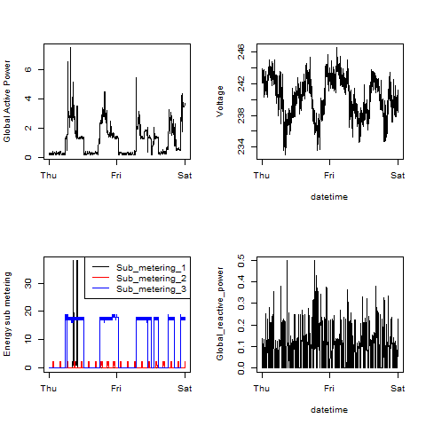

## loadPlotData.R

The common code to load data. It is called from all four main scripts: plot1.R, plot2.R, plot3.R and plot4.R.

* Download data from "https://d396qusza40orc.cloudfront.net/exdata%2Fdata%2Fhousehold_power_consumption.zip"
* Unzip data file
* Load Data for "2007-02-01", "2007-02-02" only as data frame
	

## plot1.R

The Plot1 script (plot1.R) does the following:

1. Souce loadPlotData.R - The common code to load required data.	 
2. set plot Device (480x480) as png file
3. Create Histogram 
4. Close Device file

## Running the script
To run the script, source `plot1.R`. After running, you will see the following output as the script works:
```
[Sat Feb 06 20:45:01 2016 ] Exploratory Data Analysis.
[Sat Feb 06 20:45:01 2016 ] Assignment: 1.
[Sat Feb 06 20:45:01 2016 ] Author: Samarjit Roy.
[Sat Feb 06 20:45:01 2016 ] Plot 1: Global Active Power.
[Sat Feb 06 20:45:01 2016 ] 
[Sat Feb 06 20:45:01 2016 ] if current directory does not have data subdir, create one...completed.
[Sat Feb 06 20:45:01 2016 ] download zip file from the source...completed.
[Sat Feb 06 20:45:01 2016 ] if zip file exists, unzip with overwrite..completed.
[Sat Feb 06 20:45:03 2016 ] Finding Last row number for Date '2007-02-01'  '2007-02-02'.....completed.
[Sat Feb 06 20:45:12 2016 ] Load Data into Data Frame with limited rows( 69517 ) from the lardge file..completed.
[Sat Feb 06 20:45:13 2016 ] convert date and time variables to Date/Time class...completed.
[Sat Feb 06 20:45:14 2016 ] only use data from the dates 2007-02-01 and 2007-02-02...completed.
[Sat Feb 06 20:45:14 2016 ] Set Plot Device to plot1.p as 480x480...completed.
[Sat Feb 06 20:45:14 2016 ] Creating Histogram on device: 2 ...completed.
[Sat Feb 06 20:45:14 2016 ] Closing current device: 2 ....completed.
```


## plot2.R

The Plot2 script (plot2.R) does the following:

1. Souce loadPlotData.R - The common code to load required data.	 
2. set plot Device (480x480) as png file
3. Plotting line 
4. Close Device file

## Running the script
To run the script, source `plot2.R`. After running, you will see the following output as the script works:
```
[Sat Feb 06 21:25:04 2016 ] Exploratory Data Analysis.
[Sat Feb 06 21:25:04 2016 ] Assignment: 1.
[Sat Feb 06 21:25:04 2016 ] Author: Samarjit Roy.
[Sat Feb 06 21:25:04 2016 ] Plot 2: Global Active Power (kilowatts).
[Sat Feb 06 21:25:04 2016 ] 
[Sat Feb 06 21:25:04 2016 ] if current directory does not have data subdir, create one...completed.
[Sat Feb 06 21:25:04 2016 ] download zip file from the source...completed.
[Sat Feb 06 21:25:04 2016 ] if zip file exists, unzip with overwrite..completed.
[Sat Feb 06 21:25:06 2016 ] Finding Last row number for Date '2007-02-01'  '2007-02-02'.....completed.
[Sat Feb 06 21:25:16 2016 ] Load Data into Data Frame with limited rows( 69517 ) from the lardge file..completed.
[Sat Feb 06 21:25:16 2016 ] convert date and time variables to Date/Time class...completed.
[Sat Feb 06 21:25:17 2016 ] only use data from the dates 2007-02-01 and 2007-02-02...completed.
[Sat Feb 06 21:25:17 2016 ] Set Plot Device to plot2.p as 480x480...completed.
[Sat Feb 06 21:25:17 2016 ] Plotting line on device: 2 ...completed.
[Sat Feb 06 21:25:17 2016 ] Closing current device: 2 ....completed.
```


## plot3.R

The Plot3 script (plot3.R) does the following:

1. Souce loadPlotData.R - The common code to load required data.	 
2. set plot Device (480x480) as png file
3. Plot and line 
4. Close Device file

## Running the script
To run the script, source `plot3.R`. After running, you will see the following output as the script works:
```
[Sat Feb 06 21:28:51 2016 ] Exploratory Data Analysis.
[Sat Feb 06 21:28:51 2016 ] Assignment: 1.
[Sat Feb 06 21:28:51 2016 ] Author: Samarjit Roy.
[Sat Feb 06 21:28:51 2016 ] Plot 3: Energy sub metering.
[Sat Feb 06 21:28:51 2016 ] 
[Sat Feb 06 21:28:51 2016 ] if current directory does not have data subdir, create one...completed.
[Sat Feb 06 21:28:51 2016 ] download zip file from the source...completed.
[Sat Feb 06 21:28:51 2016 ] if zip file exists, unzip with overwrite..completed.
[Sat Feb 06 21:28:53 2016 ] Finding Last row number for Date '2007-02-01'  '2007-02-02'.....completed.
[Sat Feb 06 21:29:02 2016 ] Load Data into Data Frame with limited rows( 69517 ) from the lardge file..completed.
[Sat Feb 06 21:29:03 2016 ] convert date and time variables to Date/Time class...completed.
[Sat Feb 06 21:29:03 2016 ] only use data from the dates 2007-02-01 and 2007-02-02...completed.
[Sat Feb 06 21:29:03 2016 ] Set Plot Device to plot3.p as 480x480...completed.
[Sat Feb 06 21:29:04 2016 ] Plotting line on device: 2 ...completed.
[Sat Feb 06 21:29:04 2016 ] Creating Legend...completed.
[Sat Feb 06 21:29:04 2016 ] Closing current device: 2 ....completed.
```


## plot4.R

The Plot4 script (plot4.R) does the following:

1. Souce loadPlotData.R - The common code to load required data.	 
2. set plot Device (480x480) as png file
3. setting multi-paneled plot
4. Plot on panel one by one
5. Close Device file

## Running the script
To run the script, source `plot4.R`. After running, you will see the following output as the script works:
```
[Sat Feb 06 21:31:04 2016 ] Exploratory Data Analysis.
[Sat Feb 06 21:31:04 2016 ] Assignment: 1.
[Sat Feb 06 21:31:04 2016 ] Author: Samarjit Roy.
[Sat Feb 06 21:31:04 2016 ] Plot 4: Multi-paneled plot.
[Sat Feb 06 21:31:04 2016 ] 
[Sat Feb 06 21:31:04 2016 ] if current directory does not have data subdir, create one...completed.
[Sat Feb 06 21:31:04 2016 ] download zip file from the source...completed.
[Sat Feb 06 21:31:04 2016 ] if zip file exists, unzip with overwrite..completed.
[Sat Feb 06 21:31:06 2016 ] Finding Last row number for Date '2007-02-01'  '2007-02-02'.....completed.
[Sat Feb 06 21:31:15 2016 ] Load Data into Data Frame with limited rows( 69517 ) from the lardge file..completed.
[Sat Feb 06 21:31:16 2016 ] convert date and time variables to Date/Time class...completed.
[Sat Feb 06 21:31:17 2016 ] only use data from the dates 2007-02-01 and 2007-02-02...completed.
[Sat Feb 06 21:31:17 2016 ] Set Plot Device to plot4.p as 480x480...completed.
[Sat Feb 06 21:31:17 2016 ] setting multi-paneled plot on device: 2 ....completed.
[Sat Feb 06 21:31:17 2016 ] Plotting on panel: 1...completed.
[Sat Feb 06 21:31:17 2016 ] Plotting on panel: 2...completed.
[Sat Feb 06 21:31:17 2016 ] Plotting on panel: 3...completed.
[Sat Feb 06 21:31:17 2016 ] Plotting on panel: 4...completed.
[Sat Feb 06 21:31:17 2016 ] Closing current device: 2 ....completed.
```


